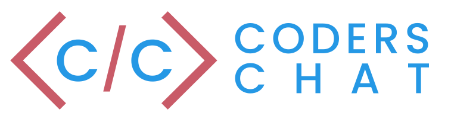

## Coders Chat - Chat App Assignment using Socket.io

This is my web chat app that I designed and built, this is also in conjunction with my program Interactive Media Design at Fanshawe College. 

## Getting Started

These instructions will get you a copy of the project up and running on your local machine for development and testing purposes. See deployment for notes on how to deploy the project on a live system.

### Cloning the Project

Before you can do anything you first must clone the git repository, in terminal paste: 

```
$ git clone https://github.com/grahamvickers/vickers_graham_coder_chat.git
```

### Prerequisites

You must have the following programs installed to run this application: 

* Node.js

### Installing

You will need to install the following in order to run the website:

* [Node.js](https://nodejs.org/en/download/current/) must be installed for the content to be displayed, follow the install steps below:


Install through the command line (required):

```
$ npm install 
```

Node.js Packages:
```
$ npm i -s express
```

## Deployment

Once everything is installed, now in terminal within the project folder, type:

```
$ npm start
```

Now in the browser of your choice go to: localhost:3030

## Built With

* HTML5 - Layout
* CSS3 - Styling
* JaveScript - Functions
* [Socket.io](https://socket.io/) - API
* [Vue.js](https://vuejs.org/) - JS modules and framework
* [Node.js](https://nodejs.org/en/) - Framework
* [Sass](https://sass-lang.com/) - CSS compiler
* [Gulp](https://gulpjs.com/) - JS enhancement
* [Express](https://expressjs.com/) - Handlebars 

## Browser Capability 

* Chrome - 100%
* Firefox - 100%
* Safari - 95%

## Issues 

* Disconnect Bug - Users are alerted of a disconnection message & alert after about 5/10 minutes, although they never have left.

## Author

* **Graham Vickers** - *Design & Build* - [Fanshawe College](https://github.com/grahamvickers)

## Acknowledgments

* Thanks to [Trevor](https://github.com/Trevor-FanshaweC) for teaching me how to use vue.js, greensock, and socket.io to complete this project.

## License 
MIT

